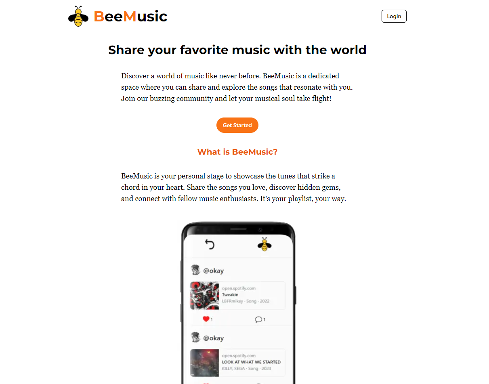

<h1>BeeMusic</h1>

[Live](https://beemusic.kutaybekleric.com/)

<h3>Fullstack GraphQL social media app</h3>

<h4>Note:The backend is hosted on Render, so TTFB(Time to first byte) might be long. Please be patient with the first requests</h4>

# Introduction

Beemusic is a fullstack social media app that allows users to share their music taste with others. Users can create posts, like posts, comment on posts(more stuff to come). The backend is built with Express.js and Apollo GraphQL. The frontend is built with Next.js and Apollo GraphQL. The database is PostgreSQL and Prisma is used as an ORM.

## Tech Stack

- Next.js
- Express.js
- Apollo GraphQL
- PostgreSQL
- TailwindCSS
- shadcn/ui
- Typescript & Zod
- Prisma

## Features

- <b>Customize Profile</b>  

Currently, users can change their avatar from a given list of avatars. I plan to add more functionality. Please check the [Roadmap](#roadmap) for more to come.

- <b>Custom Music Preview</b> 

When users share their spotify links, the app automatically fetches the album cover and the song name.

- <b>Zod and DOMpurify for validation</b>  

Used Zod for validation and DOMpurify to sanitize the user input. Going to look more into ways to prevent XSS attacks and make the app more secure.

- <b>Design system with Storybook</b>  

I used Storybook to create a design system for the app. I used shadcn/ui for the components. While I am aware that documentation is more for a team, I wanted to learn how to use Storybook and create a design system.

- <b>GraphQL for communication</b> 

Wanted to try out GraphQL after using REST for a time. Trying to get a hang of each communication method's pros and cons. Next is tRPC.

- <b>Testing</b> 

Added some unit tests for frontend and backend.

- <b>JWT Authentication</b>  

Going to focus more on OAuth and other authentication methods in the future projects.

- <b>Prioritizing UX</b> 

My main goal in most of my projects is to make UX as smooth as possible. In this app while considering UX, I tried to emphasize the UX for *power*, *above average* and *average* users. So implemented some stuff regarding the authentication. Try deleting the USER or JWT cookie in any of the pages.

### Roadmap

- [x] ~~Add tests~~ (Added tests for backend and frontend)
- [ ] Add tabs for browsing posts (Followed vs World)
- [ ] Add follow system
- [x] ~~Improve the design system with Storybook~~
- [ ] Add YouTube preview
- [ ] Users can like comments
- [ ] Make the app accessible as much as possible
- [ ] Handle errors more gracefully
- [ ] Cleanup the code, optimize the queries
- [ ] Give more importance to server components, but don't stress too much.
- [ ] More customization for profile (Bio,change username etc.)
- [ ] **MAYBE** add real time updates with GraphQL subscriptions
